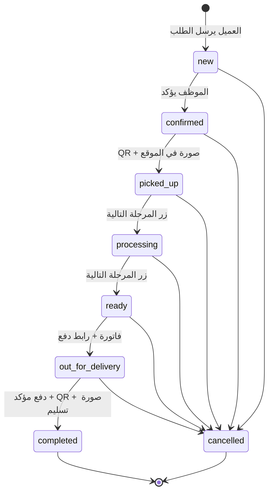
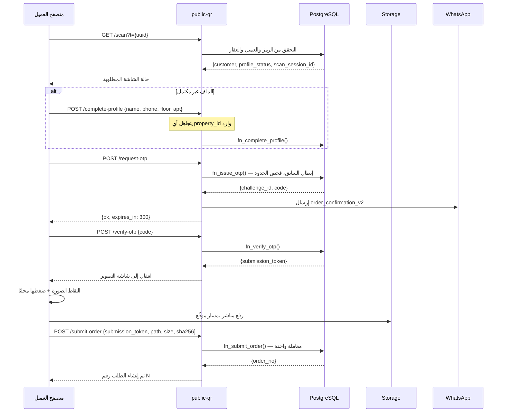
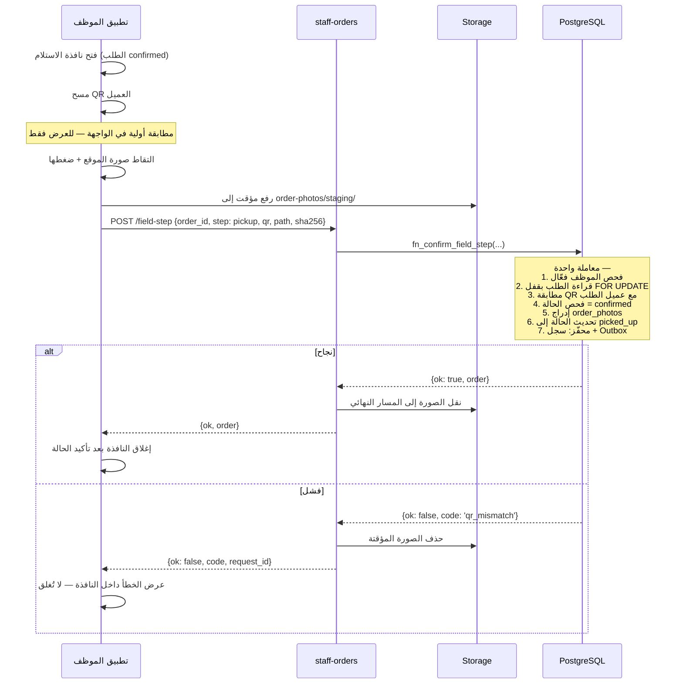
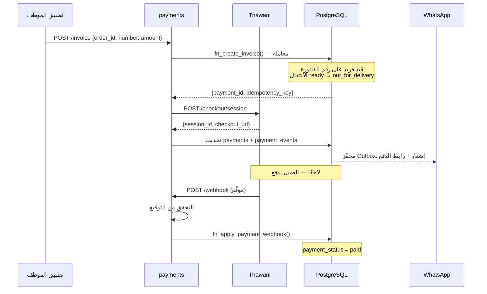
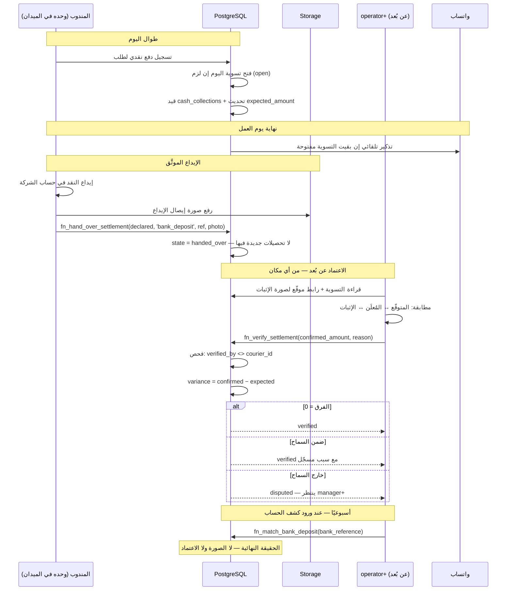

# 04 — تدفقات النطاق

## 1. آلة حالات الطلب



### مصفوفة الانتقالات المسموحة

| من ↓ / إلى → | new | confirmed | picked_up | processing | ready | out_for_delivery | completed | cancelled |
|---|---|---|---|---|---|---|---|---|
| **new** | — | ✓ يدوي | ✗ | ✗ | ✗ | ✗ | ✗ | ✓ |
| **confirmed** | ✗ | — | ✓ **ميداني** | ✗ | ✗ | ✗ | ✗ | ✓ |
| **picked_up** | ✗ | ✗ | — | ✓ يدوي | ✗ | ✗ | ✗ | ✓ |
| **processing** | ✗ | ✗ | ✗ | — | ✓ يدوي | ✗ | ✗ | ✓ |
| **ready** | ✗ | ✗ | ✗ | ✗ | — | ✓ **فاتورة** | ✗ | ✓ |
| **out_for_delivery** | ✗ | ✗ | ✗ | ✗ | ✗ | — | ✓ **ميداني + دفع** | ✓ |
| **completed** | ✗ | ✗ | ✗ | ✗ | ✗ | ✗ | — | ✗ **مقفل** |
| **cancelled** | ✗ | ✗ | ✗ | ✗ | ✗ | ✗ | ✗ | — **مقفل** |

المصفوفة مطبَّقة في `trg_orders_guard_transition`. كل خانة `✗` هي حالة اختبار
في [09-testing.md](09-testing.md).

### ثلاثة أنواع من الانتقالات

| النوع | كيف يحدث | أمثلة |
|---|---|---|
| **يدوي** | زر واحد «المرحلة التالية» + فحص تفاؤلي للحالة الحالية | `confirmed`, `processing`, `ready` |
| **ميداني** | مسح QR + صورة في الموقع، في دالة ذرّية واحدة | `picked_up`, `completed` |
| **مشروط** | يتطلب بيانات إضافية صحيحة | `out_for_delivery` (فاتورة)، `cancelled` (سبب) |

> **ملاحظة تصميم**: النظام الحالي كان يعرض قائمة منسدلة لاختيار أي حالة. هذا
> سمح بقفزات غير منطقية وأنتج طلبات في حالات متضاربة. هنا: زر واحد باتجاه واحد،
> والانتقالات الحساسة لا تحدث بضغطة إطلاقًا.

---

## 2. رحلة العميل



### القواعد الملزمة

| # | القاعدة | مكان الفرض |
|---|---|---|
| 1 | الرمز صالح، غير مُبطل، العميل فعّال، العقار فعّال | `fn_complete_profile` + فهرس جزئي |
| 2 | العقار **لا يُعرض ولا يُقبل** من العميل | الدالة تقرأ `property_id` من سجل العميل فقط |
| 3 | الملف يصبح `complete` بعد نجاح OTP، لا قبله | `fn_verify_otp` |
| 4 | الطلب يُنشأ بعد الصورة، لا بعد OTP | `fn_submit_order` يتطلب مسار صورة |
| 5 | رمز إرسال واحد لكل تحدٍّ، استخدام واحد | `unique(otp_challenge_id)` + `consumed_at` |
| 6 | إعادة الإرسال تُعيد نفس الطلب لا طلبًا جديدًا | `unique(submission_id)` على `orders` |
| 7 | الهاتف يُوحَّد إلى `+968XXXXXXXX` | تحقق في الدالة + قيد `CHECK` |
| 8 | لا تكرار هاتف بين العملاء الفعّالين | فهرس فريد جزئي |

### حدود OTP

| الحد | القيمة | مكان الفرض |
|---|---|---|
| طول الرمز | 6 أرقام، مولَّد تشفيريًا | `public-qr` |
| الصلاحية | 300 ثانية | `expires_at` |
| المحاولات | 5 ثم `blocked` | `attempts` + `CHECK` |
| إعادة الإرسال | بعد 60 ثانية | `fn_issue_otp` |
| لكل عميل | 5 رسائل / ساعة | استعلام على `otp_challenges` |
| لكل IP | 20 محاولة / ساعة | `ip_hash` في `scan_events` |
| عند إصدار رمز جديد | السابق يصبح `superseded` | `fn_issue_otp` |

---

## 3. الاستلام الميداني



### لماذا هذا التصميم بالذات

النظام الحالي استهلك أربعة طلبات متتالية من المستخدم على هذا المسار وحده.
كل قرار هنا يقابل عطلًا حقيقيًا:

| قرار التصميم | العطل الذي يمنعه |
|---|---|
| المطابقة والتحديث في دالة واحدة | «الرمز يُقرأ بنجاح والطلب لا يتحدث» |
| النافذة لا تُغلق إلا بعد تأكيد من قاعدة البيانات | «تُغلق النافذة ولا يتحدث الطلب» |
| **لا** `refreshSession()` في معالج الزر | السبب الجذري للعطل الأصلي |
| رمز خطأ صريح + `request_id` معروض | «تعذر إتمام العملية» بلا معلومة |
| حذف الصورة المؤقتة عند الفشل | صور يتيمة في التخزين |
| لا تعبير منتظم على مسار الصورة في القيد | `invalid_photo_path` |
| المطابقة في الخادم، والواجهة للعرض فقط | تجاوز الفحص بتعديل JavaScript |

---

## 4. التسليم الميداني

نفس مسار الاستلام مع شرطين إضافيين يُفحصان **داخل نفس المعاملة**:

```
1. الحالة الحالية = out_for_delivery
2. payment_status = 'paid'  ← يُفحص في الدالة وفي قيد CHECK
3. مطابقة QR مع عميل الطلب
4. صورة التسليم
   ↓
completed (حالة نهائية مقفلة)
```

### منطق البوابة في الواجهة

```
الطلب out_for_delivery و unpaid
   ├── زر «تأكيد التسليم» معطّل مع سبب ظاهر
   └── الإجراءات المتاحة:
       ├── «تحقق من ثواني»   (أي موظف)
       └── «استلمت المبلغ نقدًا»  (المندوب نفسه — من استلم فعلًا)
            ↓ يفتح نافذة تأكيد بالمبلغ
            ↓ يُقيَّد في تسوية المندوب اليومية
       زر «تأكيد التسليم» يصبح فعّالًا
```

المندوب هو من يضغط هذا الزر لأنه من استلم النقد. المبلغ يُقيَّد باسمه فورًا،
ويظهر في تسويته اليومية — فالتسجيل والمسؤولية متلازمان.

الواجهة تمنع البدء، وقاعدة البيانات ترفض التنفيذ. الطبقتان مستقلتان، فتعديل
JavaScript لا يكفي لتجاوز القاعدة.

---

## 5. الفوترة والدفع



### ثلاث طبقات لتأكيد الدفع

| الطبقة | آلية العمل | متى تفيد |
|---|---|---|
| **webhook** | ثواني يستدعينا مباشرة بعد الدفع | الطبقة الأساسية — فورية وموثوقة |
| **استعلام عند العودة** | العميل يعود لصفحة النجاح ← نستعلم عن الجلسة | إذا تأخر الـwebhook |
| **مصالحة دورية** | مهمة كل 15 دقيقة تفحص الجلسات المعلّقة > 10 دقائق | إذا ضاع الـwebhook والعميل أغلق المتصفح |

النظام الحالي يملك الطبقة الثانية فقط — ومعناها أن دفعة ناجحة تبقى `unpaid` إذا
أغلق العميل المتصفح.

### القواعد المالية

| # | القاعدة | مكان الفرض |
|---|---|---|
| 1 | رقم الفاتورة فريد | فهرس فريد |
| 2 | القيمة ≥ 0.100 ر.ع، `DECIMAL(12,3)` لا `FLOAT` | قيد `CHECK` |
| 3 | التحويل إلى بيسة عند الإرسال لثواني | `amount_baisa = round(amount * 1000)` |
| 4 | فشل إنشاء الجلسة ← لا انتقال حالة | معاملة واحدة |
| 5 | `success=true` في الرابط ليس دليل دفع | `payments-webhook` وحده يؤكد |
| 6 | دفع نقدي: يسجّله المندوب ويُقيَّد في تسويته | `fn_record_cash_payment` |
| 7 | إلغاء دفع مؤكد: `admin` فقط، بسبب إلزامي | فحص الدور + `CHECK` |
| 8 | دفع أكدته ثواني لا يُلغى يدويًا | فحص `payment_method` في الدالة |
| 9 | كل جلسة لها `idempotency_key` فريد | فهرس فريد |

> **إغلاق فجوة المسؤولية**: تسجيل الدفع النقدي يُنشئ التزامًا ماليًا على المندوب
> فورًا، تغلقه **التسوية اليومية** في القسم 6. المندوب يسجّل لأنه الحاضر، لكنه
> لا يعتمد على نفسه — الاعتماد من `operator` فأعلى.

---

## 6. التسوية النقدية اليومية

المندوب يعمل وحده غالبًا، والمدقّق يعتمد عن بُعد. لذلك الإقفال يقوم على
**إثبات إيداع موثَّق**، لا على عدّ حضوري.

**الطريقة المعتمدة: الإيداع البنكي في حساب الشركة.** اختيارها ليس تفضيلًا
شكليًا — هي الطريقة الوحيدة التي للنقد فيها مصدر تحقق مستقل عنّا وعن المندوب.

### الدورة اليومية



### الأدوار في الدورة

| الخطوة | من | لماذا هو تحديدًا |
|---|---|---|
| استلام النقد | المندوب | الحاضر الوحيد عند التسليم |
| تسجيل التحصيل | المندوب | من استلم يسجّل — لا وسيط يضيع بينهما |
| الإيداع وتوثيقه | المندوب | هو من يودع فعلًا |
| الاعتماد من الإثبات | `operator`+ عن بُعد | رقابة مستقلة لا تشترط الحضور |
| اعتماد فرق كبير | `manager`+ | قرار مالي يتجاوز الرقابة اليومية |
| المطابقة البنكية | `operator`+ | الحقيقة النهائية للإيداعات |

### طرق التسليم

| الطريقة | الحالة | الإثبات | المرجع | مطابقة بنكية | سبب استثناء |
|---|---|---|---|---|---|
| `bank_deposit` | **الافتراضية** | صورة إيصال **إلزامية** | رقم الإيصال **إلزامي** | نعم | — |
| `transfer` | استثناء | لقطة التحويل **إلزامية** | رقم العملية **إلزامي** | نعم | **إلزامي** |
| `office_handover` | استثناء | صورة اختيارية | اسم المستلم | لا | **إلزامي** |
| `safe_drop` | استثناء | صورة اختيارية | رقم الظرف | لا | **إلزامي** |

`bank_deposit` مختارة مسبقًا في النافذة. الطرق الأخرى متاحة — البنك قد يكون
مغلقًا أو المبلغ صغيرًا — لكن كل واحدة تتطلب **سببًا مكتوبًا** وتظهر في تقرير
«استثناءات الإيداع». الاستثناء ممكن لكنه مرئي، وهذا ما يُبقيه استثناءً.

### لماذا الإيداع البنكي تحديدًا

| الطريقة | من يتحقق من المبلغ؟ |
|---|---|
| إيداع بنكي | **البنك** — طرف ثالث لا مصلحة له |
| تحويل | البنك، لكن من حساب المندوب الشخصي غالبًا |
| تسليم مكتب | موظف آخر — يحتاج حضوره، وهو ما لا نملكه |
| إيداع خزنة | لا أحد حتى فتح الخزنة |

في نموذج «مندوب وحده + مدقّق عن بُعد»، الإيداع البنكي هو الطريقة الوحيدة التي
لا تعتمد صحتها على حضور أحد.

### مهلة الإيداع بأيام العمل

البنك مغلق في العطل. لذلك `cash.max_unhanded_days` يُحسب بأيام العمل لا
بالأيام التقويمية:

```
حصّل الخميس  →  الجمعة والسبت لا يُحتسبان  →  المهلة تبدأ الأحد
```

بلا هذا، مندوب يعمل يوم خميس كان سيُحجب صباح الأحد بلا ذنب.

### الضوابط

| # | الضابط | مكان الفرض |
|---|---|---|
| 1 | لا يعتمد أحد تسويته هو | قيد `CHECK` + فحص في الدالة |
| 2 | `expected_amount` محسوب من النظام | محفّز `trg_settlement_recalc` |
| 3 | `variance` عمود محسوب | `GENERATED ALWAYS AS` |
| 4 | الإيداع والتحويل يتطلبان إثباتًا مصوَّرًا **ومرجعًا** | قيد `CHECK` |
| 4ب | أي طريقة غير الإيداع البنكي تتطلب سببًا مكتوبًا | قيد `CHECK` |
| 5 | **بصمة `sha256` فريدة للإثبات** | فهرس فريد — يمنع إعادة استخدام إيصال قديم |
| 6 | فرق غير صفري يتطلب سببًا | قيد `CHECK` |
| 7 | فرق خارج السماح يتطلب `manager`+ | قيد `CHECK` |
| 8 | التسوية المعتمدة مقفلة عدا المطابقة البنكية | محفّز `trg_settlement_final_lock` |
| 9 | **الحجب من عدم الإيداع لا من تأخر الاعتماد** | فحص `state = 'open'` في `fn_record_cash_payment` |
| 9ب | المهلة بأيام العمل لا التقويمية | `working_days_between()` + `public_holidays` |
| 10 | `handed_over` لا تقبل تحصيلات جديدة | فحص في الدالة — تُفتح تسوية اليوم التالي |

> **الضابط 9 هو التصحيح الأهم لواقع العمل المنفرد**: المندوب الذي سلّم ووثّق
> لا يُحجب لأن المدقّق لم يفتح هاتفه بعد. الحجب عقوبة على الاحتفاظ بالنقد،
> لا على بطء غيره.

### حدود النموذج

الاعتماد عن بُعد يؤكد **الإثبات**، لا **النقد**. لكن مع الإيداع البنكي
كطريقة افتراضية، الإثبات نفسه له مصدر تحقق مستقل خلال أيام.

ما يكشفه النظام:

| الحالة | متى تُكتشف |
|---|---|
| إيداع أقل مما حُصِّل | **فورًا** — الفرق يظهر عند الاعتماد |
| إيصال مُعاد استخدامه | **فورًا** — بصمة `sha256` |
| إيداع لم يصل البنك | **خلال أسبوع** — المطابقة البنكية |
| تأخير متكرر في الإيداع | **خلال أسابيع** — تقرير فجوة الإيداع |
| تهرّب من الإيداع البنكي | **فورًا** — تقرير استثناءات الإيداع |

ما يبقى مكشوفًا: الفترة بين التحصيل والإيداع، وهي فترة لا يغطيها أي نظام —
يغطيها تقصير المهلة والمتابعة.

ويبقى **العدّ المفاجئ** ضابطًا دوريًا — إجراء إداري لا ميزة برمجية. النظام
يوثّق ويكشف الأنماط؛ لا يدّعي أنه يغني عن الثقة والمتابعة.

### مسارات الفشل

| السيناريو | السلوك |
|---|---|
| مندوب نسي الإيداع | تذكير واتساب آخر اليوم؛ تحصيل الغد يفتح تسوية جديدة والقديمة تبقى `open` |
| تجاوز `cash.max_unhanded_days` | زر «استلمت المبلغ نقدًا» معطّل برسالة صريحة |
| أودع ووثّق والمدقّق متأخر | **لا حجب**؛ تنبيه على المدقّق بعد `cash.verify_sla_hours` |
| البنك مغلق (عطلة) | المهلة بأيام العمل لا تُحتسب العطل؛ وإن لزم، طريقة استثنائية بسبب |
| صورة الإثبات غير واضحة | المدقّق يعيدها `disputed` بسبب، ويطلب إعادة رفع |
| محاولة رفع إيصال مستخدم سابقًا | مرفوض ببصمة `sha256` |
| الإيداع لم يظهر في الكشف خلال `cash.bank_match_sla_days` | تنبيه عالي الخطورة ← تحقيق فوري |
| استثناءات إيداع متكررة من مندوب | تقرير «استثناءات الإيداع» يكشف النمط ← قرار إداري |
| `operator` يحاول اعتماد تسويته | مرفوض في قاعدة البيانات، لا بإخفاء الزر |
| خطأ في مبلغ تحصيل قبل التسليم | إلغاء التحصيل بسبب ثم إعادة تسجيله |
| خطأ اكتُشف بعد الاعتماد | قيد تصحيحي في تسوية لاحقة — لا تعديل على المعتمدة |
| مندوب غادر بتسوية مفتوحة | `manager` يوثّق الظرف ويعتمد بعد تسوية النقد خارج النظام |

### التقارير

| التقرير | الجمهور | المحتوى |
|---|---|---|
| تسويتي | المندوب | المتوقّع اليوم، التحصيلات، حالة الإيداع |
| بانتظار الاعتماد | `operator`+ | تسويات مُودَعة مرتبة بالأقدم، مع مؤشر تجاوز الـSLA |
| النقد غير المودَع | `operator`+ | مبالغ `open` لكل مندوب بعمر **أيام العمل** ومؤشر الحجب |
| **المطابقة البنكية المعلّقة** | `operator`+ | إيداعات معتمدة بلا مرجع بنكي — تقرير أسبوعي أساسي |
| **استثناءات الإيداع** | `manager`+ | كل تسوية أُقفلت بغير الإيداع البنكي، وسببها |
| تاريخ الفروق | `manager`+ | فروق كل مندوب عبر الزمن، متوسطها واتجاهها |
| فجوة الإيداع | `manager`+ | متوسط الزمن بين التحصيل والإيداع لكل مندوب |

---

## 7. الإشعارات

```
تغيّر الحالة (داخل المعاملة)
   └─ محفّز يقرأ order_status_settings
        ├── notify_enabled = false ← إدراج بحالة skipped (للتدقيق)
        └── notify_enabled = true  ← إدراج pending في Outbox
                                       مع idempotency_key فريد
                    ↓ (خارج المعاملة)
   دالة notifications كل دقيقة
        └─ سحب المستحقات ← إرسال ← تحديث الحالة
             ├── نجاح ← sent + provider_msg_id
             └── فشل  ← failed + تراجع أسّي: 1د، 5د، 15د، 60د، 6س
                        بعد 5 محاولات ← dead + تنبيه
```

**مبدأ**: الإشعار **لا يُرجع** حالة الطلب أبدًا. الحالة حقيقة تشغيلية، والإشعار
أثر جانبي. هذا مطبَّق بأن الإدراج في الطابور داخل المعاملة والإرسال خارجها.

### القوالب

| القالب | المتغيرات | الاستخدام |
|---|---|---|
| `order_confirmation_v2` | `{{1}}` التحية، `{{2}}` رمز OTP | التحقق فقط |
| `ar_template` | `{{1}}` نص تحديث الحالة | كل تغييرات الحالة |

رمز OTP **لا يمر عبر Outbox** — يُرسل مباشرة ولا يُخزَّن في أي جدول. الطابور
يحفظ محتواه في `params`، ووضع رمز تحقق هناك يناقض مبدأ عدم تخزينه.

---

## 8. إنشاء العميل ورمز QR

```
الموظف ← «إنشاء QR لعميل جديد»
   └─ نافذة: اختيار عقار فعّال (إلزامي، لا افتراضي)
        └─ fn_create_customer_with_qr() — معاملة واحدة
             ├── customers: property_id، profile_status = incomplete
             ├── customer_qr_tokens: رمز جديد
             └── audit_logs
        └─ عرض QR للطباعة أو التنزيل
             رابط: https://qr.myduby.com/?t={uuid}
```

### إعادة إصدار الرمز

```
fn_reissue_qr(customer_id, reason)
   ├── revoked_at = now() على الرمز الحالي + السبب + من أبطله
   ├── إصدار رمز جديد
   └── تدقيق
```

الرمز القديم يُرفض فورًا برسالة **«هذا الرمز أُبطل — اطلب رمزًا جديدًا»**، لا
برسالة «رمز غير صالح». الفرق مهم: العميل يعرف أن عليه التواصل معنا، والموظف
يعرف عند التشخيص أن الرمز كان صحيحًا يومًا.

---

## 9. مسارات الفشل

| السيناريو | السلوك المطلوب |
|---|---|
| مسح رمز مُبطل | رسالة صريحة + تسجيل `revoked_qr` في `scan_events` |
| مسح رمز لعميل معطَّل | رسالة صريحة + تسجيل `inactive_customer` |
| تجاوز حد OTP | رسالة بوقت الانتظار المتبقي + تسجيل `blocked` |
| انقطاع الشبكة أثناء رفع الصورة | إعادة محاولة تلقائية مرتين ثم زر يدوي؛ الطلب لا يُنشأ |
| فشل الصورة بعد نجاح OTP | رمز الإرسال يبقى صالحًا 15 دقيقة — يعيد المحاولة بلا OTP جديد |
| QR الموظف لا يطابق عميل الطلب | `409 qr_mismatch` + لا تغيّر حالة + النافذة تبقى مفتوحة |
| تسليم طلب غير مدفوع | الزر معطّل + الدالة ترفض + القيد يرفض |
| موظفان يحدّثان نفس الطلب معًا | `FOR UPDATE` + فحص تفاؤلي ← الثاني يحصل على `stale_state` ويُعاد تحميل الطلب |
| فشل ثواني عند إنشاء الجلسة | لا فاتورة ولا انتقال حالة؛ رسالة واضحة |
| فشل واتساب | الحالة تتغير، الإشعار يُعاد محاولته؛ مؤشر ظاهر في بطاقة الطلب |
| webhook مكرر من ثواني | `idempotency_key` يجعل التطبيق الثاني بلا أثر |
