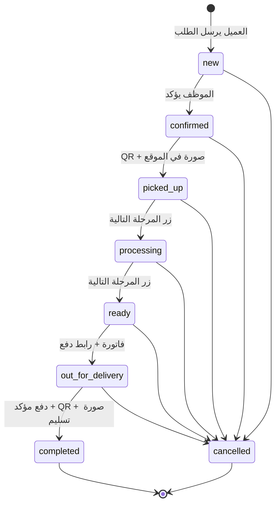
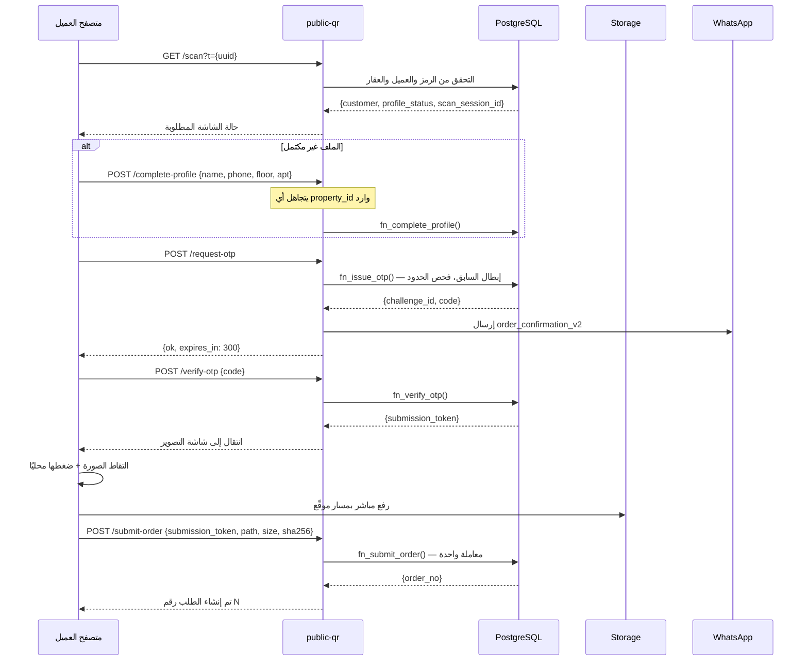
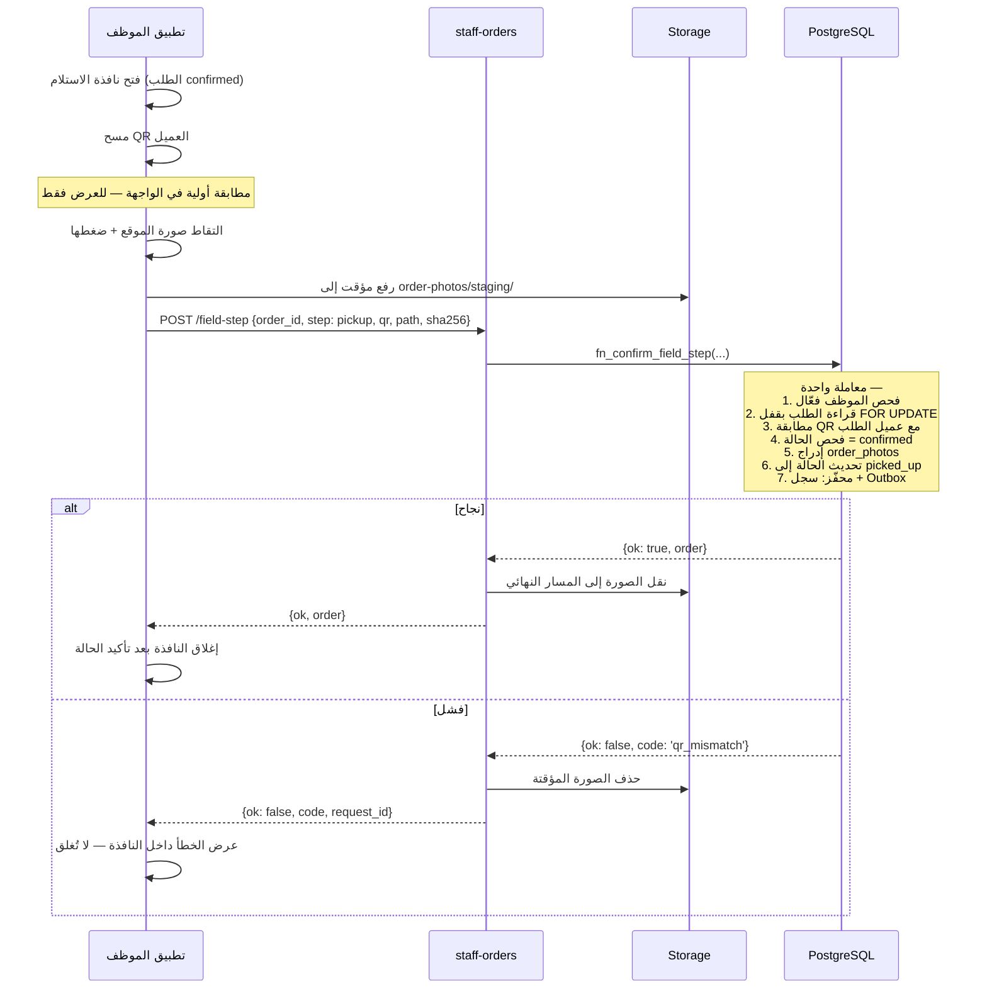
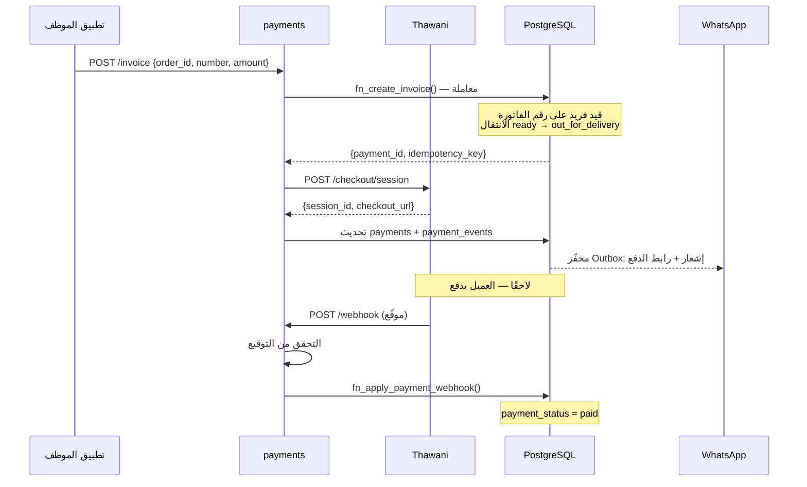

# 04 — تدفقات النطاق

## 1. آلة حالات الطلب



### مصفوفة الانتقالات المسموحة

| من ↓ / إلى → | new | confirmed | picked_up | processing | ready | out_for_delivery | completed | cancelled |
|---|---|---|---|---|---|---|---|---|
| **new** | — | ✓ يدوي | ✗ | ✗ | ✗ | ✗ | ✗ | ✓ |
| **confirmed** | ✗ | — | ✓ **ميداني** | ✗ | ✗ | ✗ | ✗ | ✓ |
| **picked_up** | ✗ | ✗ | — | ✓ يدوي | ✗ | ✗ | ✗ | ✓ |
| **processing** | ✗ | ✗ | ✗ | — | ✓ يدوي | ✗ | ✗ | ✓ |
| **ready** | ✗ | ✗ | ✗ | ✗ | — | ✓ **فاتورة** | ✗ | ✓ |
| **out_for_delivery** | ✗ | ✗ | ✗ | ✗ | ✗ | — | ✓ **ميداني + دفع** | ✓ |
| **completed** | ✗ | ✗ | ✗ | ✗ | ✗ | ✗ | — | ✗ **مقفل** |
| **cancelled** | ✗ | ✗ | ✗ | ✗ | ✗ | ✗ | ✗ | — **مقفل** |

المصفوفة مطبَّقة في `trg_orders_guard_transition`. كل خانة `✗` هي حالة اختبار
في [09-testing.md](09-testing.md).

### ثلاثة أنواع من الانتقالات

| النوع | كيف يحدث | أمثلة |
|---|---|---|
| **يدوي** | زر واحد «المرحلة التالية» + فحص تفاؤلي للحالة الحالية | `confirmed`, `processing`, `ready` |
| **ميداني** | مسح QR + صورة في الموقع، في دالة ذرّية واحدة | `picked_up`, `completed` |
| **مشروط** | يتطلب بيانات إضافية صحيحة | `out_for_delivery` (فاتورة)، `cancelled` (سبب) |

> **ملاحظة تصميم**: النظام الحالي كان يعرض قائمة منسدلة لاختيار أي حالة. هذا
> سمح بقفزات غير منطقية وأنتج طلبات في حالات متضاربة. هنا: زر واحد باتجاه واحد،
> والانتقالات الحساسة لا تحدث بضغطة إطلاقًا.

---

## 2. رحلة العميل



### القواعد الملزمة

| # | القاعدة | مكان الفرض |
|---|---|---|
| 1 | الرمز صالح، غير مُبطل، العميل فعّال، العقار فعّال | `fn_complete_profile` + فهرس جزئي |
| 2 | العقار **لا يُعرض ولا يُقبل** من العميل | الدالة تقرأ `property_id` من سجل العميل فقط |
| 3 | الملف يصبح `complete` بعد نجاح OTP، لا قبله | `fn_verify_otp` |
| 4 | الطلب يُنشأ بعد الصورة، لا بعد OTP | `fn_submit_order` يتطلب مسار صورة |
| 5 | رمز إرسال واحد لكل تحدٍّ، استخدام واحد | `unique(otp_challenge_id)` + `consumed_at` |
| 6 | إعادة الإرسال تُعيد نفس الطلب لا طلبًا جديدًا | `unique(submission_id)` على `orders` |
| 7 | الهاتف يُوحَّد إلى `+968XXXXXXXX` | تحقق في الدالة + قيد `CHECK` |
| 8 | لا تكرار هاتف بين العملاء الفعّالين | فهرس فريد جزئي |

### حدود OTP

| الحد | القيمة | مكان الفرض |
|---|---|---|
| طول الرمز | 6 أرقام، مولَّد تشفيريًا | `public-qr` |
| الصلاحية | 300 ثانية | `expires_at` |
| المحاولات | 5 ثم `blocked` | `attempts` + `CHECK` |
| إعادة الإرسال | بعد 60 ثانية | `fn_issue_otp` |
| لكل عميل | 5 رسائل / ساعة | استعلام على `otp_challenges` |
| لكل IP | 20 محاولة / ساعة | `ip_hash` في `scan_events` |
| عند إصدار رمز جديد | السابق يصبح `superseded` | `fn_issue_otp` |

---

## 3. الاستلام الميداني



### لماذا هذا التصميم بالذات

النظام الحالي استهلك أربعة طلبات متتالية من المستخدم على هذا المسار وحده.
كل قرار هنا يقابل عطلًا حقيقيًا:

| قرار التصميم | العطل الذي يمنعه |
|---|---|
| المطابقة والتحديث في دالة واحدة | «الرمز يُقرأ بنجاح والطلب لا يتحدث» |
| النافذة لا تُغلق إلا بعد تأكيد من قاعدة البيانات | «تُغلق النافذة ولا يتحدث الطلب» |
| **لا** `refreshSession()` في معالج الزر | السبب الجذري للعطل الأصلي |
| رمز خطأ صريح + `request_id` معروض | «تعذر إتمام العملية» بلا معلومة |
| حذف الصورة المؤقتة عند الفشل | صور يتيمة في التخزين |
| لا تعبير منتظم على مسار الصورة في القيد | `invalid_photo_path` |
| المطابقة في الخادم، والواجهة للعرض فقط | تجاوز الفحص بتعديل JavaScript |

---

## 4. التسليم الميداني

نفس مسار الاستلام مع شرطين إضافيين يُفحصان **داخل نفس المعاملة**:

```
1. الحالة الحالية = out_for_delivery
2. payment_status = 'paid'  ← يُفحص في الدالة وفي قيد CHECK
3. مطابقة QR مع عميل الطلب
4. صورة التسليم
   ↓
completed (حالة نهائية مقفلة)
```

### منطق البوابة في الواجهة

```
الطلب out_for_delivery و unpaid
   ├── زر «تأكيد التسليم» معطّل مع سبب ظاهر
   └── الإجراءات المتاحة:
       ├── «تحقق من ثواني»   (أي موظف)
       └── «تسجيل دفع نقدي»  (manager فأعلى)
            ↓ بعد التأكيد
       زر «تأكيد التسليم» يصبح فعّالًا
```

الواجهة تمنع البدء، وقاعدة البيانات ترفض التنفيذ. الطبقتان مستقلتان، فتعديل
JavaScript لا يكفي لتجاوز القاعدة.

---

## 5. الفوترة والدفع



### ثلاث طبقات لتأكيد الدفع

| الطبقة | آلية العمل | متى تفيد |
|---|---|---|
| **webhook** | ثواني يستدعينا مباشرة بعد الدفع | الطبقة الأساسية — فورية وموثوقة |
| **استعلام عند العودة** | العميل يعود لصفحة النجاح ← نستعلم عن الجلسة | إذا تأخر الـwebhook |
| **مصالحة دورية** | مهمة كل 15 دقيقة تفحص الجلسات المعلّقة > 10 دقائق | إذا ضاع الـwebhook والعميل أغلق المتصفح |

النظام الحالي يملك الطبقة الثانية فقط — ومعناها أن دفعة ناجحة تبقى `unpaid` إذا
أغلق العميل المتصفح.

### القواعد المالية

| # | القاعدة | مكان الفرض |
|---|---|---|
| 1 | رقم الفاتورة فريد | فهرس فريد |
| 2 | القيمة ≥ 0.100 ر.ع، `DECIMAL(12,3)` لا `FLOAT` | قيد `CHECK` |
| 3 | التحويل إلى بيسة عند الإرسال لثواني | `amount_baisa = round(amount * 1000)` |
| 4 | فشل إنشاء الجلسة ← لا انتقال حالة | معاملة واحدة |
| 5 | `success=true` في الرابط ليس دليل دفع | `payments-webhook` وحده يؤكد |
| 6 | دفع نقدي: `manager`+ فقط | فحص الدور داخل الدالة |
| 7 | إلغاء دفع مؤكد: `admin` فقط، بسبب إلزامي | فحص الدور + `CHECK` |
| 8 | دفع أكدته ثواني لا يُلغى يدويًا | فحص `payment_method` في الدالة |
| 9 | كل جلسة لها `idempotency_key` فريد | فهرس فريد |

> **ملاحظة مفتوحة للنقاش**: «الدفع النقدي عند التسليم» يُسجَّل حاليًا `paid`
> قبل التسليم الفعلي — أي أن الموظف يعلن استلام النقد ثم يسلّم. هذا يخلق فجوة
> مسؤولية. اقتراحي: إضافة **تسوية نقدية يومية** لكل مندوب تطابق ما سجّله بما
> سلّمه للصندوق. غير مُدرج في النسخة الأولى، ومقترح للمرحلة التالية.

---

## 6. الإشعارات

```
تغيّر الحالة (داخل المعاملة)
   └─ محفّز يقرأ order_status_settings
        ├── notify_enabled = false ← إدراج بحالة skipped (للتدقيق)
        └── notify_enabled = true  ← إدراج pending في Outbox
                                       مع idempotency_key فريد
                    ↓ (خارج المعاملة)
   دالة notifications كل دقيقة
        └─ سحب المستحقات ← إرسال ← تحديث الحالة
             ├── نجاح ← sent + provider_msg_id
             └── فشل  ← failed + تراجع أسّي: 1د، 5د، 15د، 60د، 6س
                        بعد 5 محاولات ← dead + تنبيه
```

**مبدأ**: الإشعار **لا يُرجع** حالة الطلب أبدًا. الحالة حقيقة تشغيلية، والإشعار
أثر جانبي. هذا مطبَّق بأن الإدراج في الطابور داخل المعاملة والإرسال خارجها.

### القوالب

| القالب | المتغيرات | الاستخدام |
|---|---|---|
| `order_confirmation_v2` | `{{1}}` التحية، `{{2}}` رمز OTP | التحقق فقط |
| `ar_template` | `{{1}}` نص تحديث الحالة | كل تغييرات الحالة |

رمز OTP **لا يمر عبر Outbox** — يُرسل مباشرة ولا يُخزَّن في أي جدول. الطابور
يحفظ محتواه في `params`، ووضع رمز تحقق هناك يناقض مبدأ عدم تخزينه.

---

## 7. إنشاء العميل ورمز QR

```
الموظف ← «إنشاء QR لعميل جديد»
   └─ نافذة: اختيار عقار فعّال (إلزامي، لا افتراضي)
        └─ fn_create_customer_with_qr() — معاملة واحدة
             ├── customers: property_id، profile_status = incomplete
             ├── customer_qr_tokens: رمز جديد
             └── audit_logs
        └─ عرض QR للطباعة أو التنزيل
             رابط: https://qr.myduby.com/?t={uuid}
```

### إعادة إصدار الرمز

```
fn_reissue_qr(customer_id, reason)
   ├── revoked_at = now() على الرمز الحالي + السبب + من أبطله
   ├── إصدار رمز جديد
   └── تدقيق
```

الرمز القديم يُرفض فورًا برسالة **«هذا الرمز أُبطل — اطلب رمزًا جديدًا»**، لا
برسالة «رمز غير صالح». الفرق مهم: العميل يعرف أن عليه التواصل معنا، والموظف
يعرف عند التشخيص أن الرمز كان صحيحًا يومًا.

---

## 8. مسارات الفشل

| السيناريو | السلوك المطلوب |
|---|---|
| مسح رمز مُبطل | رسالة صريحة + تسجيل `revoked_qr` في `scan_events` |
| مسح رمز لعميل معطَّل | رسالة صريحة + تسجيل `inactive_customer` |
| تجاوز حد OTP | رسالة بوقت الانتظار المتبقي + تسجيل `blocked` |
| انقطاع الشبكة أثناء رفع الصورة | إعادة محاولة تلقائية مرتين ثم زر يدوي؛ الطلب لا يُنشأ |
| فشل الصورة بعد نجاح OTP | رمز الإرسال يبقى صالحًا 15 دقيقة — يعيد المحاولة بلا OTP جديد |
| QR الموظف لا يطابق عميل الطلب | `409 qr_mismatch` + لا تغيّر حالة + النافذة تبقى مفتوحة |
| تسليم طلب غير مدفوع | الزر معطّل + الدالة ترفض + القيد يرفض |
| موظفان يحدّثان نفس الطلب معًا | `FOR UPDATE` + فحص تفاؤلي ← الثاني يحصل على `stale_state` ويُعاد تحميل الطلب |
| فشل ثواني عند إنشاء الجلسة | لا فاتورة ولا انتقال حالة؛ رسالة واضحة |
| فشل واتساب | الحالة تتغير، الإشعار يُعاد محاولته؛ مؤشر ظاهر في بطاقة الطلب |
| webhook مكرر من ثواني | `idempotency_key` يجعل التطبيق الثاني بلا أثر |
